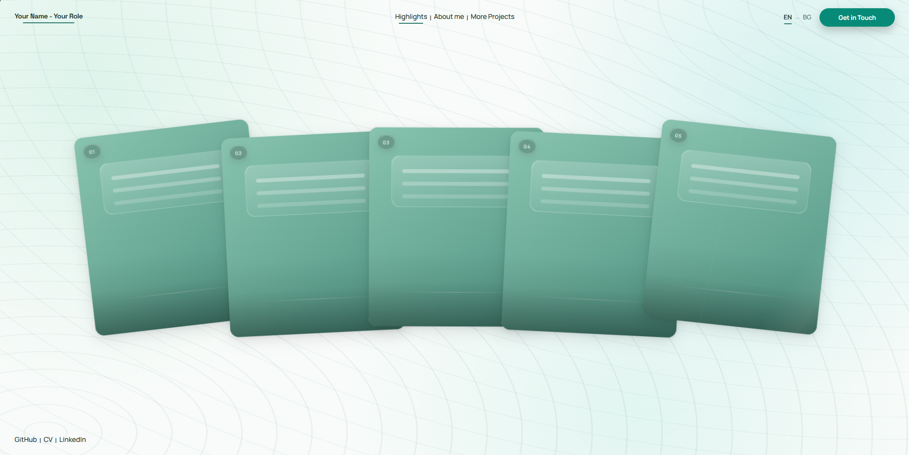
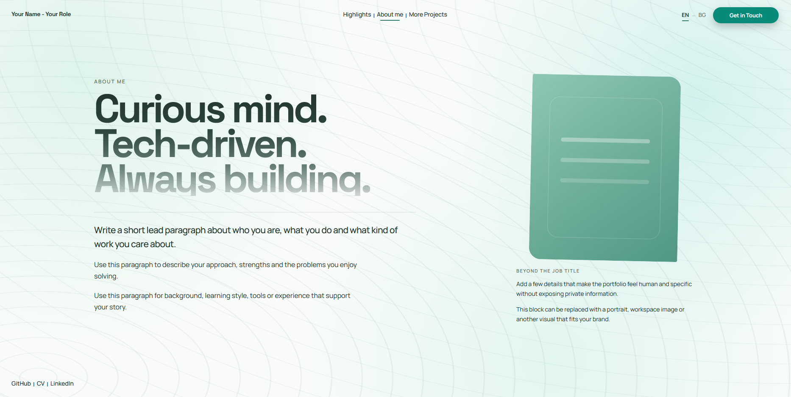
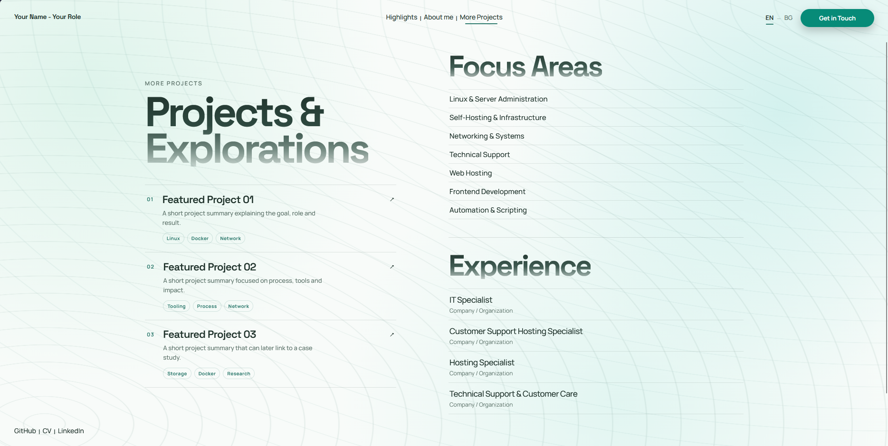

# Vue Editorial Portfolio Template

A modern, interactive and multilingual portfolio template built with **Vue 3**, **Vite** and **Vue Router**.

It is designed for developers, IT professionals, designers, freelancers and other creatives who want a clean portfolio with visual highlight cards, smooth transitions and a reusable structure.

## Preview

### Home



### About



### Projects



## Features

- Vue 3 + Vite
- Vue Router with animated page transitions
- Responsive layout for desktop, tablet and mobile
- Interactive highlight card deck
- Five dedicated highlight detail pages
- About page
- Projects and experience page
- Custom asset loader
- Multilingual EN / BG support
- Animated language switching
- Persistent language preference
- Clipboard contact button
- Reusable Vue components
- Custom CSS design system
- Image preloading
- No UI framework required
- MIT license included

## Tech Stack

- **Vue 3**
- **Vite**
- **Vue Router**
- **JavaScript**
- **HTML5**
- **CSS3**

The interface is built with custom Vue components and CSS without a third-party UI framework.

## Project Structure

```text
src/
├── components/
│   ├── HighlightCards.vue
│   └── PortfolioHighlights.vue
├── composables/
│   └── useLanguage.js
├── router/
│   └── index.js
├── views/
│   ├── AboutMeView.vue
│   ├── HighlightDetailView.vue
│   ├── HighlightsView.vue
│   └── MoreProjectsView.vue
├── App.vue
├── about.css
├── highlight-detail.css
├── main.js
├── more-projects.css
└── style.css
```

## Getting Started

Requirements:

- Node.js
- npm

Clone the repository:

```bash
git clone https://github.com/Sureebi/Portfolio-template.git
```

Enter the project directory:

```bash
cd Portfolio-template
```

Install dependencies:

```bash
npm install
```

Start the development server:

```bash
npm run dev
```

Create a production build:

```bash
npm run build
```

Preview the production build locally:

```bash
npm run preview
```

## Routes

```text
/
├── /intro
├── /outside-work
├── /journey
├── /lab-projects
├── /next
├── /about-me
└── /more-projects
```

Each highlight card opens its own page. Route definitions live in `src/router/index.js`; card targets live in `src/components/PortfolioHighlights.vue`.

## Customization Guide

### Text Content

Most visible copy is stored in:

```text
src/composables/useLanguage.js
```

Update the `en` and `bg` message objects to change the site identity, navigation labels, highlight cards, detail pages, About page, project content, focus areas and experience labels.

### Highlight Cards

Highlight cards are configured in:

```text
src/components/PortfolioHighlights.vue
```

The default structure is:

```js
{
  id: '01',
  title: t('highlights.about.title'),
  description: t('highlights.about.description'),
  to: '/intro'
}
```

### Images

The template uses abstract placeholder visuals by default. To add project or profile imagery:

1. Put the image file in `src/assets/`.
2. Import it in `src/components/PortfolioHighlights.vue` or the view that needs it.
3. Pass it through the relevant `image` property.

Example:

```js
import introImage from '../assets/intro.jpg'

{
  id: '01',
  title: t('highlights.about.title'),
  description: t('highlights.about.description'),
  image: introImage,
  to: '/intro'
}
```

The screenshots used in this README are stored in `public/Home.png`, `public/About.png` and `public/Projects.png`.

### Contact Button

The contact button copies this demo email address:

```js
const email = 'hello@example.com'
```

Update it in `src/App.vue`. The same area can be changed to a `mailto:` link, contact page, modal or form.

### Links

Footer links are in `src/App.vue`.

Project links are in `src/views/MoreProjectsView.vue`.

Template links are set to `#` until real profile, CV and project URLs are added.

### Colors and Fonts

Theme variables are defined in `src/style.css`.

```css
:root {
  --bg: #f8fbf9;
  --surface: #88c4af;
  --surface-2: #79bda7;
  --text: #21342d;
  --muted: #5e746b;
  --accent: #69c7ba;
  --accent-strong: #317c70;
}
```

The default typography uses **Space Grotesk** for display text and **Manrope** for body text.

## Multilingual Support

The project uses a small custom language system in `src/composables/useLanguage.js`.

Use translations in Vue templates with:

```vue
{{ t('nav.about') }}
```

The selected language is saved in `localStorage`, so visitors keep their preference between sessions.

## Deployment

This is a static Vite application and can be deployed to GitHub Pages, Cloudflare Pages, Netlify, Vercel or a self-hosted static server.

Because the project uses Vue Router history mode, configure the host to fall back to `index.html` for nested routes.

Example Caddy configuration:

```caddy
example.com {
    root * /var/www/portfolio
    try_files {path} /index.html
    file_server
}
```

## GitHub Template Workflow

After pushing the repository to GitHub:

1. Open the repository settings.
2. Enable **Template repository**.
3. Users can create new projects with **Use this template**.

## Suggested Personalization Checklist

- Name and role
- Email address
- Footer links
- CV link
- About copy
- Highlight page copy
- Project details
- Experience labels
- Portfolio images
- Page title
- Favicon
- Open Graph image
- Deployment target

## License

This project is released under the **MIT License**. See `LICENSE` for details.
